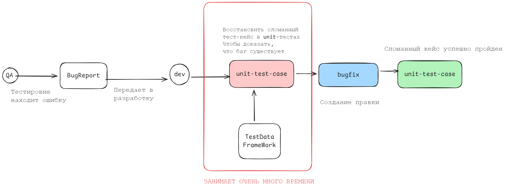
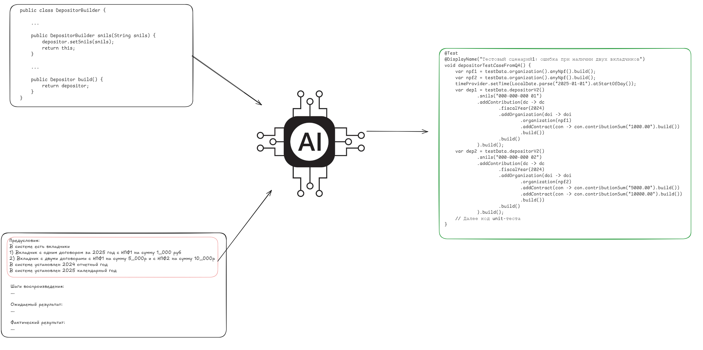

# Bug2Code - Генератор тест-данных на основе баг-репортов
___

## Трансформация системы

___
## Алгоритм работы

___
### [bug2code-core](bug2code-core)
содержит OpenRouterApi, создает промпты и получает ответы от моделей
### [bug2code-server](bug2code-server)
веб-сервер, предоставляющий интерфейсы: REST-API + TELEGRAM-BOT
### [bug2core-testframework](bug2core-testframework)
небольшой проект - заглушка для демонстрации